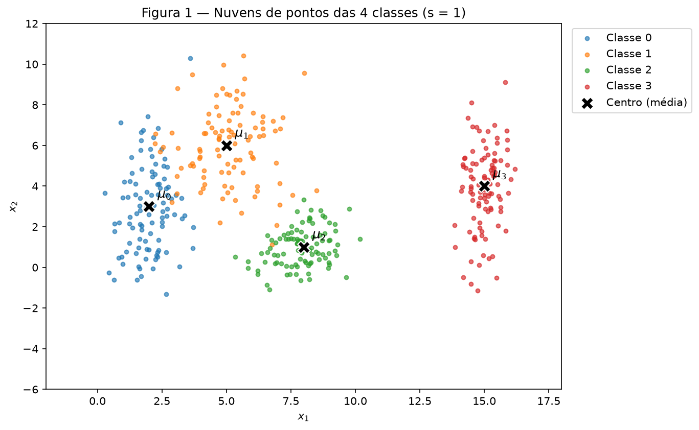
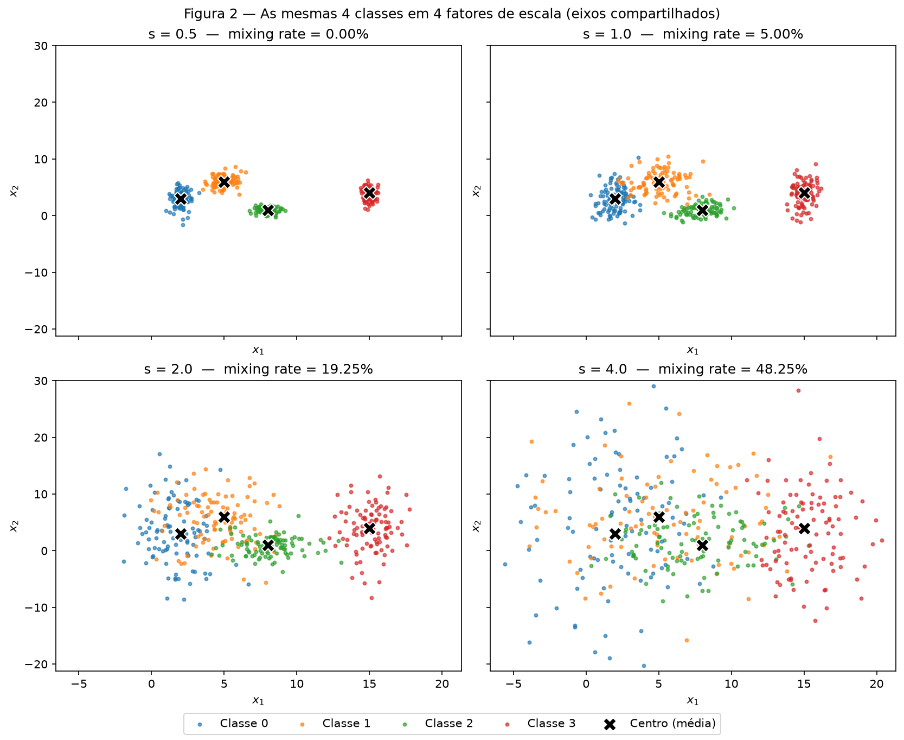
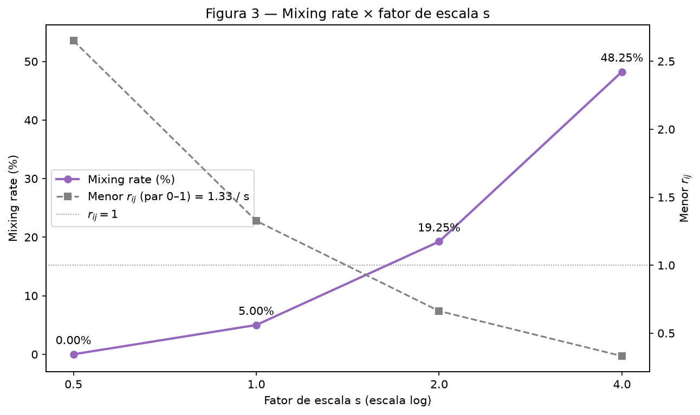
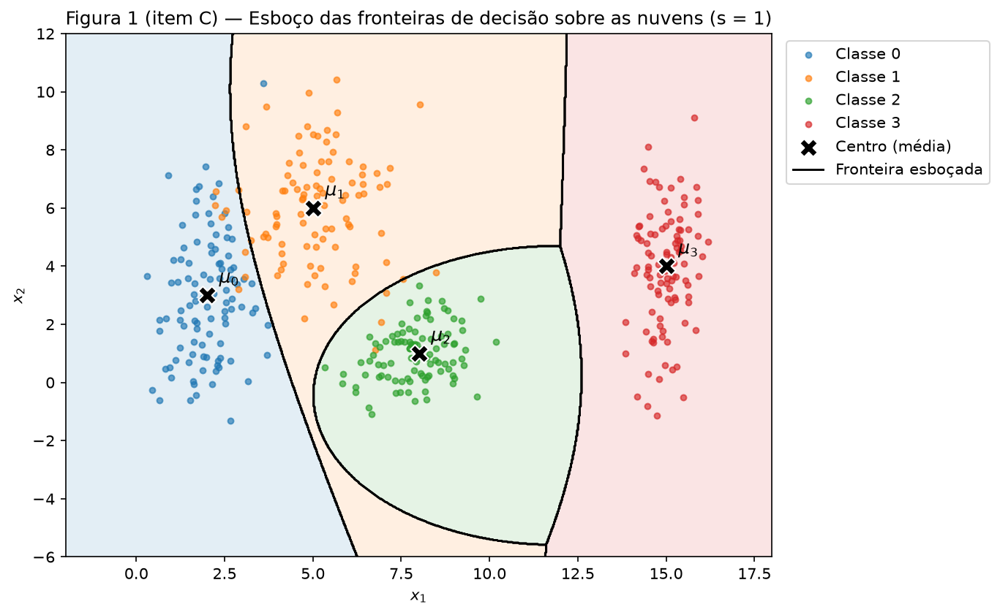
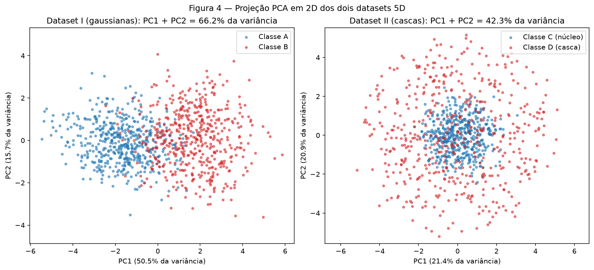
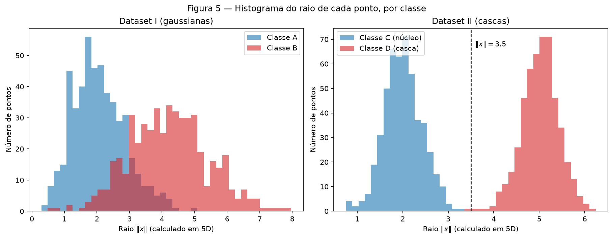

# 1. Data

!!! abstract "Enunciado"

    [Exercises → Data](https://insper.github.io/ann-dl/){:target='_blank'}

## Como reproduzir

Todo o código está em `code/`. Um único script roda os três exercícios em ordem, com **um único**
gerador `rng = np.random.default_rng(42)`, grava as figuras em `figures/` e os números em
`code/results.json`. Todos os números deste relatório vêm desse arquivo.

``` shell
python3 -m venv env && source ./env/bin/activate
python3 -m pip install -r requirements.txt
python docs/exercises/data/code/run_all.py
```

??? example "Código — `code/run_all.py` e `code/common.py`"

    ``` { .python linenums="1" title="docs/exercises/data/code/run_all.py" }
    --8<-- "docs/exercises/data/code/run_all.py"
    ```

    ``` { .python linenums="1" title="docs/exercises/data/code/common.py" }
    --8<-- "docs/exercises/data/code/common.py"
    ```

## Exercise 1

**Abordagem.** Cada classe é uma gaussiana 2D com covariância diagonal: amostro $x$ e $y$ de
forma independente, com a média e o desvio do enunciado. Para estudar o espalhamento, multiplico
todos os desvios por $s$ e mantenho as médias. Meço a separação de duas formas, sem treinar
nada: o *separation ratio* $r_{ij}$, calculado com os parâmetros, e o *mixing rate*, calculado
com os pontos sorteados.

??? example "Código — `code/ex1_point_clouds.py`"

    ``` { .python linenums="1" title="docs/exercises/data/code/ex1_point_clouds.py" }
    --8<-- "docs/exercises/data/code/ex1_point_clouds.py"
    ```

### A — Generate the clouds

A função `generate(rng, s=1.0)` sorteia 100 pontos por classe com `rng.normal(média, desvio × s)`.
São 400 pontos, 4 classes e 100 amostras por classe.


/// caption
**Figura 1** — As 4 nuvens de pontos com $s = 1$. O **X** preto marca o centro (média) de cada classe.
///

### B — More or less spread out

Gero as mesmas 4 classes com $s \in \{0.5,\ 1.0,\ 2.0,\ 4.0\}$. São 4 datasets, cada um com as 4
classes. O dataset de $s = 1$ é o próprio dataset do item A. Assim, a Figura 1 e o painel
$s = 1$ da Figura 2 mostram os mesmos pontos.


/// caption
**Figura 2** — As mesmas 4 classes nos 4 fatores de escala. Os 4 painéis têm os mesmos limites de eixo.
///

**Separation ratio em $s = 1$.** Com $\bar\sigma_0 = 1.65$, $\bar\sigma_1 = 1.55$,
$\bar\sigma_2 = 0.90$ e $\bar\sigma_3 = 1.25$:

| Par $(i, j)$ | $\lVert \mu_i - \mu_j \rVert$ | $\bar\sigma_i + \bar\sigma_j$ | $r_{ij}$ |
|:---:|---:|---:|---:|
| (0, 1) | 4.243 | 3.20 | **1.326** |
| (0, 2) | 6.325 | 2.55 | 2.480 |
| (0, 3) | 13.038 | 2.90 | 4.496 |
| (1, 2) | 5.831 | 2.45 | 2.380 |
| (1, 3) | 10.198 | 2.80 | 3.642 |
| (2, 3) | 7.616 | 2.15 | 3.542 |

O menor valor é **$r_{01} = 1.33$**, do par de classes 0 e 1. As médias não mudam e os desvios
são multiplicados por $s$, então $r_{ij}$ é dividido por $s$. Em $s = 2$, o menor valor passa a
ser **$r_{01} = 1.33 / 2 = 0.66$**. O script confere esse valor recalculando a fórmula com os
desvios dobrados.

**Mixing rate.** Para cada ponto, calculo a distância até os 4 centros do enunciado. Um ponto
"mistura" quando o centro mais próximo não é o da sua classe.

| $s$ | Mixing rate | Pontos misturados | Menor $r_{ij}$ |
|---:|---:|---:|---:|
| 0.5 | **0.0%** | 0 / 400 | 2.65 |
| 1.0 | **5.0%** | 20 / 400 | 1.33 |
| 2.0 | **19.25%** | 77 / 400 | 0.66 |
| 4.0 | **48.25%** | 193 / 400 | 0.33 |


/// caption
**Figura 3** — Mixing rate em função de $s$ (esquerda) e menor $r_{ij}$, que cai como $1/s$ (direita).
///

**A partir de qual $s$ as nuvens deixam de ser separáveis por retas?** A partir de **$s = 1.0$**.
A regra "centro mais próximo" já é um conjunto de retas: a fronteira entre dois centros é a
mediatriz do segmento que os une. Em $s = 0.5$, essas retas separam os 400 pontos sem erro.
Em $s = 1.0$, 20 pontos ficam do lado errado: 8 pontos da classe 0 estão mais perto de
$\mu_1$, 6 da classe 1 estão mais perto de $\mu_0$ e outros 6 estão mais perto de $\mu_2$.
Nesse ponto, o menor $r_{ij}$ vale **1.33**: a distância entre $\mu_0$ e $\mu_1$ é só 1.33 vez
a soma dos desvios médios, e as caudas das duas nuvens já se cruzam. Quando $s$ passa de
$1.33$, $r_{01}$ fica abaixo de 1. Em $s = 2$ ($r_{01} = 0.66$), a mistura sobe para 19.25%.

### C — Analysis

**Sobreposição em $s = 1$.** A mistura fica quase toda no par 0–1, o de menor $r_{ij}$ (1.33).
Das 20 trocas, 14 são entre essas duas classes. A classe 0 é alta ($\sigma_y = 2.5$) e invade a
região da classe 1. A classe 2 é compacta ($\sigma = 0.9$): nenhum ponto dela mistura, mas 6
pontos da classe 1 caem mais perto de $\mu_2$. A classe 3 fica isolada à direita
($r_{03} = 4.50$, $r_{13} = 3.64$, $r_{23} = 3.54$), sem nenhum ponto misturado.

**Uma única fronteira linear separa as 4 classes?** Não. Uma reta divide o plano em só duas
regiões, e há 4 classes. Uma reta separa bem só uma classe do resto: a classe 3, com uma reta
vertical perto de $x_1 \approx 12$.

**E um conjunto de fronteiras lineares?** Separa quase tudo. As retas do "centro mais próximo"
já acertam 95% dos pontos. Os 5% restantes são pontos que entraram na nuvem vizinha. Para
acertá-los, as fronteiras teriam de contornar ponto a ponto. Isso decora o ruído desta amostra e
não vale para novos pontos.


/// caption
**Figura 1 (item C)** — Esboço das fronteiras que uma rede treinada tenderia a aprender, sobre a Figura 1.
///

**Como o esboço foi feito.** Para cada ponto do plano, pintei a classe de maior densidade,
usando as gaussianas do enunciado. Nenhum modelo foi treinado: é a fronteira ideal para esses
parâmetros, e uma rede bem treinada tende a se aproximar dela. O esboço mostra três coisas:

- a fronteira 3 × resto é quase uma reta vertical em $x_1 \approx 12$;
- a fronteira 0 × 1 é uma curva suave na diagonal, entre as duas nuvens;
- a classe 2 fica dentro de uma região fechada e curva. Ela é mais compacta que as vizinhas, e
  por isso a densidade dela só vence perto do centro.

Uma rede com camadas ocultas (tanh, por exemplo) desenha curvas assim. Um perceptron sozinho
desenha só uma reta.

**Relação com o item B.** Mais espalhamento aumenta a região em que as classes se sobrepõem.
Nessa região, um mesmo lugar do plano tem pontos de duas classes, e **nenhuma** fronteira acerta
os dois. A rede pode só escolher o melhor lado, e o erro dessa região não cai com mais
treinamento. Os números mostram esse crescimento: o mixing rate vai de 0% para 5%, 19.25% e
48.25%, e o menor $r_{ij}$ cai de 2.65 para 1.33, 0.66 e 0.33. Em $s = 4$, quase metade dos
pontos está mais perto do centro errado.

## Exercise 2

**Abordagem.** Gero dois datasets em 5D, cada um com 500 pontos por classe. O Dataset I tem
duas gaussianas com centros diferentes. O Dataset II tem um núcleo dentro de uma casca, com o
mesmo centro. Comparo os dois de três formas: projeção PCA em 2D, distância entre os centros das
classes e raio $\lVert x \rVert$ de cada ponto. As duas últimas medidas usam os dados 5D
originais.

??? example "Código — `code/ex2_nonlinearity.py`"

    ``` { .python linenums="1" title="docs/exercises/data/code/ex2_nonlinearity.py" }
    --8<-- "docs/exercises/data/code/ex2_nonlinearity.py"
    ```

### A — Dataset I: shifted Gaussians

Antes de amostrar, confiro se as duas matrizes do enunciado são covariâncias válidas
(simétricas e positivas definidas). O menor autovalor é **0.158** para $\Sigma_A$ e **0.498**
para $\Sigma_B$. Os dois são positivos, então as matrizes são válidas. Amostro com
`rng.multivariate_normal(mu, Sigma, size=500, method="cholesky")`. A decomposição de Cholesky é
única, então o resultado não depende da biblioteca de álgebra linear da máquina.

### B — Dataset II: concentric shells

Cada ponto é $x = \rho \cdot u$:

- **Direção $u$:** sorteio $v \sim \mathcal{N}(0, I_5)$ e normalizo, $u = v / \lVert v \rVert$. A
  gaussiana $\mathcal{N}(0, I_5)$ tem a mesma forma em todas as direções. Por isso a direção
  normalizada é uniforme na esfera unitária.
- **Raio $\rho$:** $\mathcal{N}(2.0,\ 0.4)$ na classe C (núcleo) e $\mathcal{N}(5.0,\ 0.4)$ na
  classe D (casca). Leio 0.4 como **desvio padrão**, a convenção de `rng.normal`. Um raio
  negativo exigiria um desvio de 5σ abaixo da média, o que não acontece na prática.

### C — Visualize and compare


/// caption
**Figura 4** — Projeção PCA em 2D de cada dataset. Cada PCA é ajustado no próprio dataset.
///

| Medida | Dataset I (gaussianas) | Dataset II (cascas) |
|---|---:|---:|
| Variância explicada — PC1 | 50.5% | 21.4% |
| Variância explicada — PC2 | 15.7% | 20.9% |
| **Variância explicada — PC1 + PC2** | **66.2%** | **42.3%** |
| **Distância entre os centros das classes (5D)** | **3.399** | **0.222** |
| Distância teórica entre os centros | $\lVert \mu_B - \mu_A \rVert = 1.5\sqrt{5} = 3.354$ | 0 |
| Raio médio — 1ª classe (A / C) | 2.07 | 2.00 |
| Raio médio — 2ª classe (B / D) | 4.21 | 5.02 |

**Qual projeção preserva melhor a informação para classificar?** A do **Dataset I**. A diferença
entre as classes é o deslocamento $\mu_B - \mu_A = 1.5 \cdot (1,1,1,1,1)$, uma direção fixa. O
PC1 captura essa direção (50.5% da variância), e as classes aparecem lado a lado ao longo dele.
No Dataset II não existe direção preferida. Os 5 componentes explicam cerca de 20% cada, e o
valor 42.3% está perto de $2/5 = 40\%$. A projeção joga fora 57.7% da variância. Um ponto da
casca cuja direção está nos componentes descartados cai perto do centro da projeção, em cima do
núcleo.

**Distância entre os centros (5D).** No Dataset I, os centros ficam a **3.40** um do outro
(teoria: 3.35). No Dataset II, a distância é **0.22**, quase zero: as duas classes têm o mesmo
centro, a origem. O pequeno desvio vem da amostra finita.


/// caption
**Figura 5** — Histograma do raio $\lVert x \rVert$ (calculado em 5D), com as duas classes no mesmo eixo.
///

No Dataset I, os raios se sobrepõem muito: a classe A vai até 4.97 e a classe B começa em 0.67.
No Dataset II, os raios **não se sobrepõem**: o núcleo vai de 0.75 a **3.28**, e a casca vai de
**3.44** a 6.24.

### D — Analysis

**Centros coincidentes e raios separados: o que isso diz sobre um hiperplano?** As classes do
Dataset II não diferem na posição do centro. Elas diferem na **distância até a origem**. Um
hiperplano $w^\top x + b = 0$ separa o espaço em dois lados. A regra de decisão dele depende de
uma direção. A casca, porém, envolve o núcleo em **todas** as direções. Por isso nenhum
hiperplano deixa o núcleo de um lado e a casca inteira do outro.

**Por que nenhuma quantidade de dados resolve isso?** Tome qualquer hiperplano, com
$\lVert w \rVert = 1$, e suponha que o núcleo fique no lado $w^\top x + b < 0$:

- o núcleo tem pontos na direção $+w$, com raio perto de 2: $x = 2w$. Então $2 + b < 0$, ou
  seja, $b < -2$;
- a casca tem pontos na direção $-w$, com raio perto de 5: $x = -5w$. Para ficarem no outro
  lado, $-5 + b > 0$, ou seja, $b > 5$.

Não existe $b$ que seja menor que $-2$ e maior que $5$ ao mesmo tempo. O problema está na
geometria, e não na falta de amostras. Mais dados só preenchem melhor as direções $+w$ e $-w$ e
tornam a contradição ainda mais certa.

**Uma projeção 2D misturada prova que as classes são inseparáveis?** **Não.** O PCA é linear: ele
só gira os dados e descarta eixos. Se as classes se misturam nos 2 eixos que sobraram, a
diferença pode estar nos eixos descartados ou numa função não linear dos eixos. Meus resultados
mostram isso. Na Figura 4, o Dataset II parece misturado, com só 42.3% da variância. Mesmo
assim, em 5D, o raio separa as classes sem sobreposição (Figura 5), e a distância entre centros é
só 0.22, o que confirma que a informação não está na posição.

**Uma função simples que separa o Dataset II:**

$$
f(x) = \lVert x \rVert^2 - 3.5^2 = \sum_{i=1}^{5} x_i^2 - 12.25,
\qquad
\text{classe} =
\begin{cases}
\text{D (casca)} & \text{se } f(x) > 0 \\
\text{C (núcleo)} & \text{se } f(x) < 0
\end{cases}
$$

O limiar $3.5$ é o ponto médio dos raios do enunciado, $(2 + 5)/2$. Não o ajustei aos dados.
Essa regra classifica corretamente **99.9%** dos 1000 pontos. O único erro é o ponto da casca
com o menor raio, 3.44, que fica abaixo de 3.5. Com a nova feature $z = \lVert x \rVert^2$, a
fronteira passa a ser linear: um único limiar em $z$. Uma camada oculta faz esse tipo de
transformação: ela cria features não lineares nas quais o problema fica linear.

## Exercise 3

**Abordagem.** *Em andamento.*

### A — Get to know the data

*Em andamento.*

### B — Split before you transform

*Em andamento.*

### C — Preprocess

*Em andamento.*

### D — Verify and visualize

*Em andamento.*

## Results summary

| # | Item | Your value |
|---|------|------------|
| 1 | Mixing rate at $s = 0.5$ | 0.0% (0 / 400) |
| 2 | Mixing rate at $s = 1.0$ | 5.0% (20 / 400) |
| 3 | Mixing rate at $s = 2.0$ | 19.25% (77 / 400) |
| 4 | Mixing rate at $s = 4.0$ | 48.25% (193 / 400) |
| 5 | Smallest $r_{ij}$ at $s = 1.0$, and which pair | $r_{01} = 1.33$, par (0, 1) |
| 6 | Distance between centers — Dataset I | 3.399 |
| 7 | Distance between centers — Dataset II | 0.222 |
| 8 | Explained variance PC1 + PC2 — Dataset I | 66.2% |
| 9 | Explained variance PC1 + PC2 — Dataset II | 42.3% |
| 10 | Share of the positive class in `Transported` | |
| 11 | Mean and median of `FoodCourt` on the training set, before transforming | |
| 12 | Final shape of the training feature matrix | |
| 13 | Minimum and maximum of the training and test sets after scaling | |
