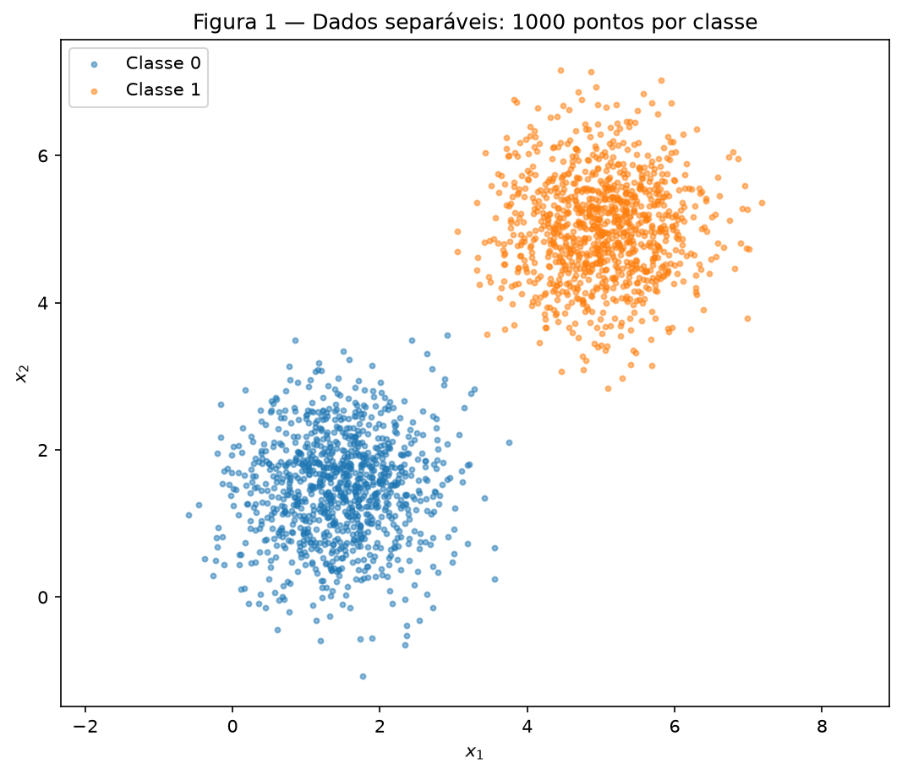
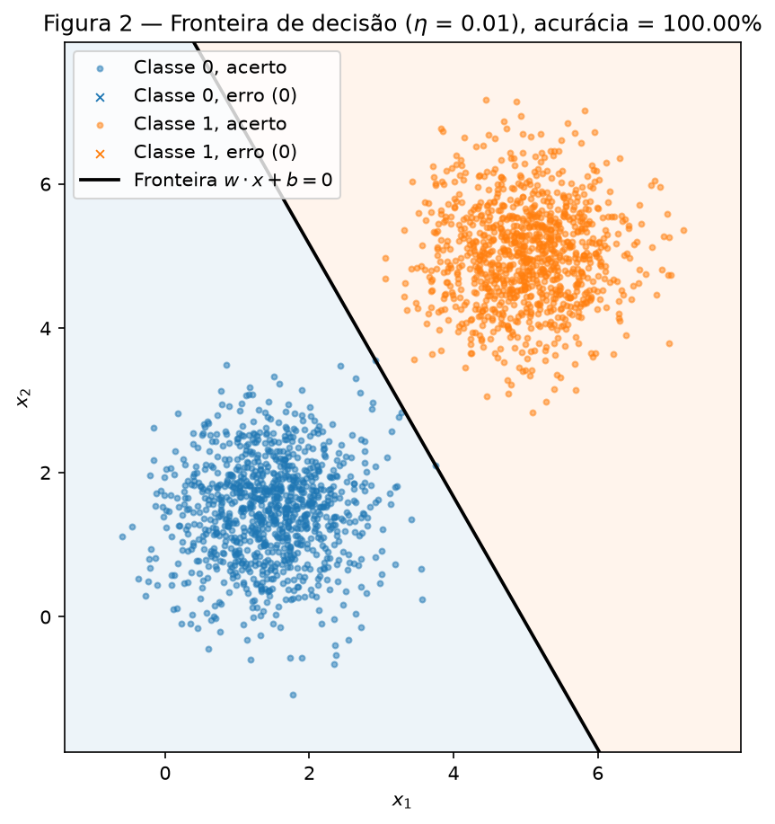
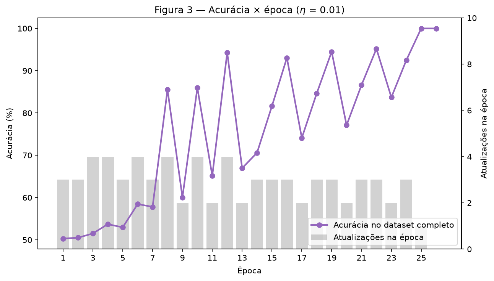
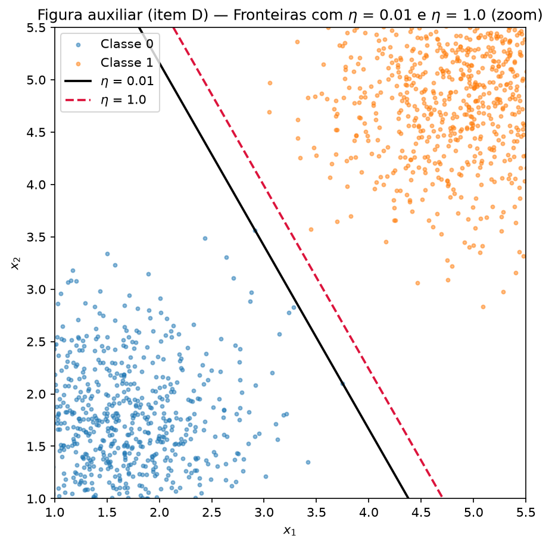
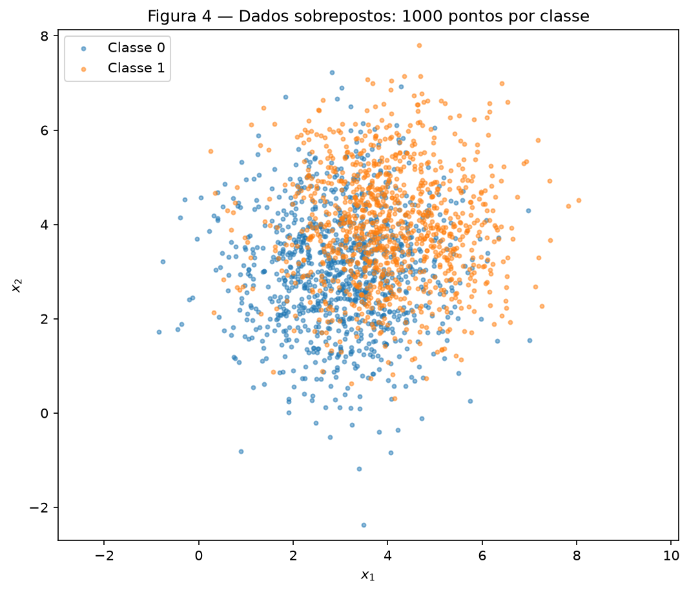
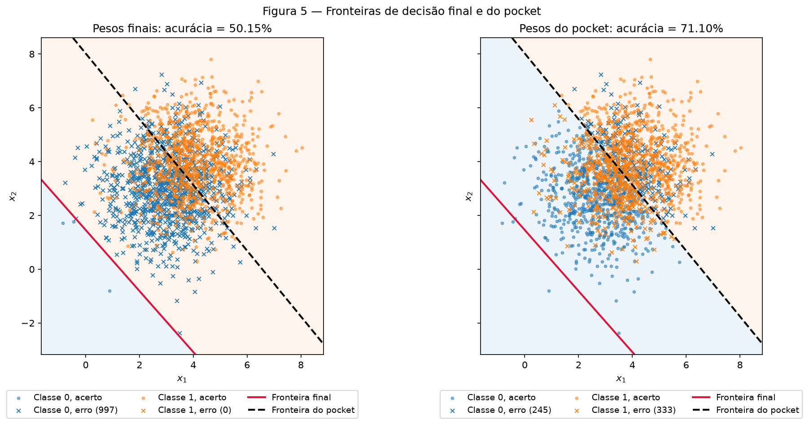
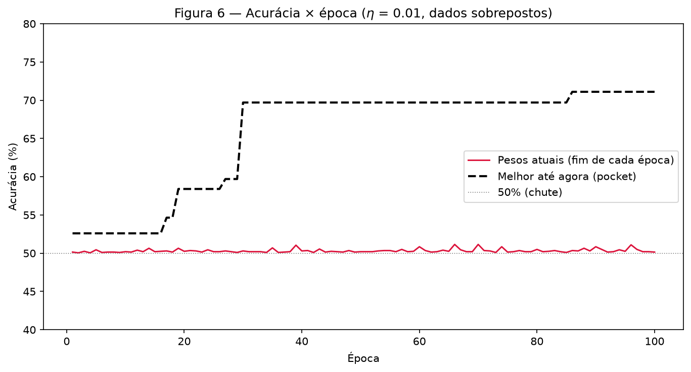

# 2. Perceptron

!!! abstract "Enunciado"

    [Exercises → Perceptron](https://insper.github.io/ann-dl/){:target='_blank'}

## Como reproduzir

Todo o código está em `code/`. Um único script roda os dois exercícios em ordem, com **um único**
gerador `rng = np.random.default_rng(42)`, grava as figuras em `figures/` e os números em
`code/results.json`. Todos os números deste relatório vêm desse arquivo. Rodei o script duas vezes
e o `results.json` saiu idêntico byte a byte.

``` shell
python3 -m venv env && source ./env/bin/activate
python3 -m pip install -r requirements.txt
python docs/exercises/perceptron/code/run_all.py
```

??? example "Código — `code/run_all.py` e `code/common.py` (geração dos dados e figuras)"

    ``` { .python linenums="1" title="docs/exercises/perceptron/code/run_all.py" }
    --8<-- "docs/exercises/perceptron/code/run_all.py"
    ```

    ``` { .python linenums="1" title="docs/exercises/perceptron/code/common.py" }
    --8<-- "docs/exercises/perceptron/code/common.py"
    ```

## Abordagem e desafios

**Abordagem.** O modelo fica num único arquivo, `code/perceptron.py`, escrito só com NumPy. Ele tem a
ativação `step`, a predição `predict`, a acurácia `accuracy`, a inicialização `init_weights` e o
laço de treino `train`. Os dois exercícios chamam a **mesma** função `train`. O Exercise 2 só passa
`pocket=True`, que liga a cópia do melhor $(\mathbf{w}, b)$. Nenhuma biblioteca fornece o modelo:
não há scikit-learn neste exercício.

Os sorteios acontecem sempre na mesma ordem: dados do Exercise 1, $\mathbf{w}$ inicial do
Exercise 1, dados do Exercise 2, $\mathbf{w}$ inicial do Exercise 2 e, por último, a permutação do
experimento extra do item 2D.

**Desafios.**

- **A ordem das amostras.** O enunciado diz "para cada amostra" e não pede embaralhamento. Uso a
  ordem da geração: 1000 pontos da classe 0 e depois 1000 da classe 1, em toda época. Essa escolha
  muda muito o resultado final do Exercise 2 (50.15% nesta ordem, 63.95% com a ordem embaralhada).
  Por isso, o item 2D mostra as duas ordens.
- **"Sem mudar mais nada" no item 1D.** A execução com $\eta = 1.0$ precisa do **mesmo**
  $\mathbf{w}$ inicial. Sorteio $\mathbf{w}_0$ uma única vez e passo o mesmo vetor às duas
  execuções. Um segundo sorteio mudaria a inicialização e a comparação perderia o sentido.
- **Custo do pocket.** O pocket mede a acurácia no dataset completo depois de **cada** atualização.
  Isso custa 2000 predições por atualização. O custo é pequeno aqui, porque o Exercise 2 faz só
  289 atualizações em 100 épocas.
- **Figura 5 legível.** Os pesos finais erram 997 pontos. Um X preto em cada erro cobria as cores
  das classes. A solução: o ponto certo aparece como bolinha e o ponto errado como "x", os dois na
  cor da classe verdadeira.

## Exercise 1

Dados separáveis: o caso para o qual o perceptron foi projetado.

??? example "Código — `code/ex1_separable.py`"

    ``` { .python linenums="1" title="docs/exercises/perceptron/code/ex1_separable.py" }
    --8<-- "docs/exercises/perceptron/code/ex1_separable.py"
    ```

### A — Generate the data

A função `generate` (em `code/common.py`) amostra 1000 pontos por classe com
`rng.multivariate_normal(média, covariância, method="cholesky")`:

- Classe 0: média $[1.5,\ 1.5]$, covariância $\begin{bmatrix} 0.5 & 0 \\ 0 & 0.5 \end{bmatrix}$;
- Classe 1: média $[5,\ 5]$, covariância $\begin{bmatrix} 0.5 & 0 \\ 0 & 0.5 \end{bmatrix}$.

A decomposição de Cholesky é única, então o resultado não depende da biblioteca de álgebra linear
da máquina. São 2000 pontos no total.


/// caption
**Figura 1** — Os 2000 pontos do Exercise 1, uma cor por classe.
///

### B — Implement the perceptron

``` { .python linenums="1" title="docs/exercises/perceptron/code/perceptron.py" }
--8<-- "docs/exercises/perceptron/code/perceptron.py"
```

As decisões pedidas pelo enunciado, e onde cada uma está no código:

- **Predição:** $\hat{y} = \text{step}(\mathbf{w} \cdot \mathbf{x} + b)$, com
  $\text{step}(z) = 1$ se $z \geq 0$ e $0$ caso contrário (`step` e `predict`).
- **Regra dirigida pelo erro, para rótulos 0/1:** o erro $e = y - \hat{y}$ vale $0$ num acerto,
  $+1$ num falso negativo e $-1$ num falso positivo. A atualização é
  $\mathbf{w} \leftarrow \mathbf{w} + \eta\, e\, \mathbf{x}$ e $b \leftarrow b + \eta\, e$.
  Um acerto não muda nada (`if error == 0: continue`). A forma $\mathbf{w} + \eta\, y\, \mathbf{x}$
  não serve aqui: com $y = 0$ ela nunca corrigiria um falso positivo.
- **Inicialização:** $\mathbf{w}$ = `rng.normal(0, 0.01, size=2)` e $b = 0$ (`init_weights`). O
  sorteio deu $\mathbf{w}_0 = [0.00253,\ 0.00895]$, com $\lVert \mathbf{w}_0 \rVert = 0.0093$.
- **Taxa de aprendizado:** $\eta = 0.01$.
- **Parada:** o laço para depois de uma época sem nenhuma atualização, ou depois de 100 épocas. A
  acurácia no dataset completo é registrada ao fim de cada época (`history["accuracy"]`).

### C — Train and measure

**Resultado com $\eta = 0.01$:**

- $\mathbf{w}$ final $= [0.05050,\ 0.02887]$;
- $b$ final $= -0.25$;
- **26 épocas**: 25 épocas com atualização e a 26ª sem nenhuma, que dispara a parada;
- **acurácia final = 100.00%** (2000 / 2000);
- 73 atualizações no total, em 52 000 visitas a amostras (0.14%).


/// caption
**Figura 2** — Fronteira $\mathbf{w} \cdot \mathbf{x} + b = 0$ sobre os pontos. O fundo mostra a classe prevista. Pontos mal classificados apareceriam como "x"; não há nenhum.
///


/// caption
**Figura 3** — Acurácia no dataset completo ao fim de cada época (curva) e número de atualizações na época (barras cinzas).
///

A acurácia chega a 100% na época 25 e fica lá. A época 26 confirma: nenhuma amostra gera erro.

### D — Analysis

**Por que dados separáveis convergem rápido?** A regra só age num erro. Num acerto,
$y - \hat{y} = 0$, e $\mathbf{w}$ e $b$ não mudam. Num erro, a atualização empurra a reta para o lado
certo daquele ponto: o escore $\mathbf{w} \cdot \mathbf{x} + b$ do ponto muda
$\eta\,(\lVert \mathbf{x} \rVert^2 + 1)$ na direção do rótulo verdadeiro. Com dados separáveis,
existe uma reta que acerta todos os pontos. Quando os pesos chegam a qualquer reta assim, o erro é
zero em todas as amostras e nenhuma atualização acontece mais. Esse estado é um ponto fixo: o laço
para.

**O que acontece com o número de atualizações por época.** Ele é pequeno desde o início e cai a
zero:

| Épocas | Atualizações por época |
|---|---|
| 1 a 12 | 3, 3, 4, 4, 3, 4, 3, 4, 2, 4, 2, 4 |
| 13 a 24 | 2, 3, 3, 3, 2, 3, 3, 2, 3, 3, 2, 3 |
| 25 | **1** |
| 26 | **0** — parada |

Das 2000 amostras de cada época, no máximo 4 geram atualização. Separei cada época em duas
metades: primeiro os 1000 pontos da classe 0, depois os 1000 da classe 1. Nas épocas 1 a 24, a
metade da classe 0 faz de 1 a 3 atualizações, e a metade da classe 1 faz **sempre exatamente 1**.
Essa última atualização empurra a reta em direção à classe 0. Por isso, no fim de cada uma dessas
épocas, **todos** os erros são falsos positivos (pontos da classe 0 previstos como 1), e não há
nenhum falso negativo. O zigue-zague da Figura 3 é o tamanho desse empurrão, que varia de época
para época: no fim da época 8 sobram 289 falsos positivos (85.55%), e no fim da época 9 sobram 799
(60.05%). Na época 25, a metade da classe 1 não erra mais, e a reta fica no vão entre as nuvens.

**Por que 26 épocas, e não 1 ou 2?** O limite é o $b$. A reta final fica a
$-b / \lVert \mathbf{w} \rVert = 4.30$ da origem. Com $\lVert \mathbf{w} \rVert = 0.058$, isso pede
$b = -0.25$. Cada erro move $b$ só $\eta = 0.01$, enquanto move $\mathbf{w}$
$\eta\,\lVert \mathbf{x} \rVert$, cerca de 2 a 7 vezes mais. E os erros das duas classes empurram $b$
em sentidos opostos: em cada época, a metade da classe 0 tira de 0.01 a 0.03 de $b$, e a metade da
classe 1 devolve 0.01. O saldo foi de 49 erros na classe 0 e 24 na classe 1: 25 passos líquidos de
$-0.01$, de 0 a 2 por época. Esse mesmo efeito, $b$ lento e $\mathbf{w}$ rápido, é o que quebra o
Exercise 2.

**Re-execução com $\eta = 1.0$** (mesmos dados, mesma ordem, mesmo $\mathbf{w}_0$):

| | $\eta = 0.01$ | $\eta = 1.0$ |
|---|---:|---:|
| $\mathbf{w}$ final | $[0.05050,\ 0.02887]$ | $[5.87062,\ 3.35924]$ |
| $b$ final | $-0.25$ | $-31.0$ |
| Épocas | **26** | **37** |
| Atualizações | 73 | 101 |
| Acurácia final | **100.00%** | **100.00%** |
| Direção $\mathbf{w} / \lVert \mathbf{w} \rVert$ | $[0.86812,\ 0.49635]$ | $[0.86795,\ 0.49665]$ |
| Distância da reta até a origem, $-b / \lVert \mathbf{w} \rVert$ | 4.298 | 4.583 |


/// caption
**Figura auxiliar (item D)** — As duas fronteiras, com zoom no vão entre as nuvens.
///

As duas execuções chegam a 100%, por fronteiras diferentes. Neste sorteio, as direções ficaram
quase iguais: o ângulo entre elas é de só **0.02°**. A diferença está na posição: as retas são
quase paralelas, mas a de $\eta = 1.0$ fica **0.29** mais longe da origem (4.583 contra 4.298), mais
perto da classe 1. O caminho também muda: 37 épocas contra 26.

**O que $\eta$ controla.** O degrau só olha o **sinal** de $\mathbf{w} \cdot \mathbf{x} + b$.
Multiplicar $(\mathbf{w}, b)$ por uma constante positiva não muda nenhuma predição. Então o tamanho
de $\eta$ sozinho não importa. O que importa é o tamanho de $\eta\,\mathbf{x}$ **em relação a**
$\mathbf{w}_0$:

- com $\eta = 1.0$, cada erro soma um vetor de norma típica 2 (classe 0) a 7 (classe 1) a um
  $\mathbf{w}_0$ de norma 0.0093. A inicialização some. Prova disso: esta execução faz as mesmas
  101 atualizações e as mesmas 37 épocas da execução que parte de $\mathbf{w} = \mathbf{0}$ com $\eta = 1.0$. Os pesos
  finais diferem exatamente por $\mathbf{w}_0$:
  $[5.87062,\ 3.35924] - [5.86808,\ 3.35029] = [0.00253,\ 0.00895] = \mathbf{w}_0$;
- com $\eta = 0.01$, cada erro soma um vetor de norma típica 0.02 a 0.07, do mesmo tamanho que
  $\mathbf{w}_0$. A inicialização muda quais pontos erram nas primeiras épocas, e isso muda todo o
  caminho: 73 atualizações e uma reta diferente.

Resumo: $\eta$ controla o peso relativo da inicialização. Formalmente, se
$\mathbf{w}_t = \mathbf{w}_0 + \eta\,\mathbf{u}_t$ e $b_t = \eta\,c_t$, então
$\text{step}(\mathbf{w}_t \cdot \mathbf{x} + b_t) = \text{step}\big((\mathbf{w}_0/\eta + \mathbf{u}_t) \cdot \mathbf{x} + c_t\big)$.
Treinar com $\eta$ a partir de $\mathbf{w}_0$ é o mesmo que treinar com passo 1 a partir de
$\mathbf{w}_0 / \eta$. Com $\eta = 0.01$, a partida efetiva é $100\,\mathbf{w}_0$, de norma 0.93.

**Partida de $\mathbf{w} = \mathbf{0}$, $b = 0$.** Mostro que duas execuções com $\eta_1$ e $\eta_2$
produzem pesos proporcionais em **todos** os passos. Sejam $(\mathbf{w}_t^{(1)}, b_t^{(1)})$ e
$(\mathbf{w}_t^{(2)}, b_t^{(2)})$ os pesos depois de $t$ amostras visitadas, e
$k = \eta_2 / \eta_1 > 0$. A hipótese de indução é

$$
\mathbf{w}_t^{(2)} = k\,\mathbf{w}_t^{(1)}, \qquad b_t^{(2)} = k\,b_t^{(1)}.
$$

**Base ($t = 0$):** $\mathbf{w}_0^{(1)} = \mathbf{w}_0^{(2)} = \mathbf{0}$ e $b_0^{(1)} = b_0^{(2)} = 0$.
Como $\mathbf{0} = k \cdot \mathbf{0}$, a hipótese vale.

**Passo:** na amostra $t + 1$, com entrada $\mathbf{x}$ e rótulo $y$,

$$
\begin{aligned}
\hat{y}^{(2)} &= \text{step}\big(\mathbf{w}_t^{(2)} \cdot \mathbf{x} + b_t^{(2)}\big)
= \text{step}\big(k\,(\mathbf{w}_t^{(1)} \cdot \mathbf{x} + b_t^{(1)})\big) \\
&= \text{step}\big(\mathbf{w}_t^{(1)} \cdot \mathbf{x} + b_t^{(1)}\big) = \hat{y}^{(1)},
\end{aligned}
$$

porque $k > 0$ não muda o sinal ($kz \geq 0 \iff z \geq 0$, inclusive em $z = 0$). Então o erro
$e = y - \hat{y}$ é o mesmo nas duas execuções, e

$$
\begin{aligned}
\mathbf{w}_{t+1}^{(2)} &= k\,\mathbf{w}_t^{(1)} + \eta_2\, e\, \mathbf{x}
= k\,\mathbf{w}_t^{(1)} + k\,\eta_1\, e\, \mathbf{x}
= k\,\mathbf{w}_{t+1}^{(1)}, \\
b_{t+1}^{(2)} &= k\,b_t^{(1)} + \eta_2\, e = k\,b_t^{(1)} + k\,\eta_1\, e = k\,b_{t+1}^{(1)}.
\end{aligned}
$$

Consequências:

- as duas execuções erram exatamente nas mesmas amostras. Então fazem as mesmas atualizações e
  param na **mesma época**;
- os pesos finais diferem só pelo fator $\eta_2 / \eta_1$;
- a fronteira $\{\mathbf{x} : \mathbf{w} \cdot \mathbf{x} + b = 0\}$ não muda quando
  $(\mathbf{w}, b)$ é multiplicado por $k > 0$. A **reta é a mesma**.

Logo, a partir do zero, $\eta$ não tem efeito algum. É por isso que o item B proíbe essa partida.
Na fórmula acima, $\mathbf{w}_0 / \eta = \mathbf{0}$ para todo $\eta$: não sobra nada para $\eta$
controlar.

**Conferência numérica.** Rodei as duas partidas do zero:

| Partida de $\mathbf{w} = \mathbf{0}$ | $\eta = 0.01$ | $\eta = 1.0$ |
|---|---:|---:|
| $\mathbf{w}$ final | $[0.058681,\ 0.033503]$ | $[5.868084,\ 3.350287]$ |
| $b$ final | $-0.31$ | $-31.0$ |
| Épocas | 37 | 37 |
| Atualizações | 101 | 101 |
| Acurácia final | 100.00% | 100.00% |

A razão é exatamente $\eta_2 / \eta_1 = 100$. A maior diferença entre $\mathbf{w}^{(2)}$ e
$100\,\mathbf{w}^{(1)}$ é $2.7 \times 10^{-15}$, só arredondamento de ponto flutuante. O ângulo
entre as duas direções é $0°$.

## Exercise 2

Dados sobrepostos: o caso que o perceptron não resolve.

??? example "Código — `code/ex2_overlapping.py`"

    ``` { .python linenums="1" title="docs/exercises/perceptron/code/ex2_overlapping.py" }
    --8<-- "docs/exercises/perceptron/code/ex2_overlapping.py"
    ```

### A — Generate the data

A mesma função `generate` do Exercise 1, com os parâmetros novos. São 1000 pontos por classe:

- Classe 0: média $[3,\ 3]$, covariância $\begin{bmatrix} 1.5 & 0 \\ 0 & 1.5 \end{bmatrix}$;
- Classe 1: média $[4,\ 4]$, covariância $\begin{bmatrix} 1.5 & 0 \\ 0 & 1.5 \end{bmatrix}$.


/// caption
**Figura 4** — Os 2000 pontos do Exercise 2, uma cor por classe. As nuvens se sobrepõem bastante.
///

### B — Train, keeping the best weights

A chamada é `train(X, y, w0, b0, eta=0.01, max_epochs=100, pocket=True)`: a mesma função do
Exercise 1, com o mesmo código. `pocket=True` liga a única adição ao laço, o bloco `if pocket:` em
`code/perceptron.py`. O resto do laço é idêntico ao do Exercise 1. Depois de cada atualização, ele mede a acurácia no dataset
completo. Se ela passa da melhor já vista, copia $(\mathbf{w}, b)$ para o "bolso". O ponto de
partida do bolso é o próprio $(\mathbf{w}_0, b_0)$, com a acurácia inicial. O sorteio deu
$\mathbf{w}_0 = [0.01216,\ -0.00451]$.

O laço nunca para por conta própria: todas as 100 épocas têm entre 2 e 5 atualizações (289 no
total).

| Conjunto de pesos | $\mathbf{w}$ | $b$ | Acurácia |
|---|---|---:|---:|
| **Finais** (depois da época 100) | $[0.05448,\ 0.04804]$ | $-0.07$ | **50.15%** |
| **Pocket** (melhor visto) | $[0.01066,\ 0.00873]$ | $-0.07$ | **71.10%** |

O melhor do pocket apareceu na **época 86**, na atualização 247 das 289.

### C — Figures


/// caption
**Figura 5** — Fronteiras final (vermelha) e do pocket (tracejada) nos dois painéis. O fundo mostra a classe prevista pelos pesos do painel. Bolinha: ponto classificado certo. "x": ponto mal classificado por esses pesos.
///


/// caption
**Figura 6** — Acurácia dos pesos atuais ao fim de cada época e melhor acurácia vista até ali (pocket).
///

### D — Analysis

**A diferença entre o pocket e os pesos finais.** A melhor reta para as distribuições do enunciado
é a mediatriz entre as médias, $x_1 + x_2 = 7$. Nesta amostra, ela acerta **71.25%** (o valor
teórico é $\Phi(0.577) = 71.8\%$). O pocket chega a **71.10%**, a 0.15 ponto dessa reta. Os pesos
finais ficam em **50.15%**, o valor de um chute.

**Onde a fronteira final fica.** A Figura 5 mostra: a reta final passa **fora** da nuvem, perto da
origem: a distância da reta até a origem é $-b / \lVert \mathbf{w} \rVert = 0.96$. O centro da nuvem, $(3.5,\ 3.5)$, fica a
**3.98** da reta, do lado "classe 1". O modelo diz "classe 1" para **99.85%** dos pontos. Ele acerta
os 1000 pontos da classe 1 e erra 997 dos 1000 pontos da classe 0. Já a reta do pocket fica a 5.08
da origem. Ela corta a nuvem ao meio, quase sobre a reta ideal, que fica a 4.95.

**Por que o laço deixa a reta ali.** Compare o quanto cada parâmetro anda por erro:

- $b$ anda $\eta = 0.01$;
- $\mathbf{w}$ anda $\eta\,\lVert \mathbf{x} \rVert \approx 0.01 \times 5.11 = 0.051$ (5.11 é a
  norma média de $\mathbf{x}$ nestes dados).

Para a reta cortar a nuvem no lugar certo, é preciso $-b / \lVert \mathbf{w} \rVert \approx 4.95$,
ou seja, $\lvert b \rvert \approx 5\,\lVert \mathbf{w} \rVert$. Mas cada erro faz $\mathbf{w}$ andar
5 vezes mais do que $b$. O pocket mostra o problema: a reta boa tem $b = -0.07$ e
$\lVert \mathbf{w} \rVert = 0.0138$. Um único erro soma 0.051 a $\mathbf{w}$, **3.7 vezes** o
tamanho do próprio $\mathbf{w}$ do pocket, e só 0.01 a $b$. A reta não se ajusta um pouco: ela
**salta**. Na maioria dos passos, a distância $-b / \lVert \mathbf{w} \rVert$ vai parar longe de
4.95, e a reta sai da nuvem.

A ordem das amostras decide para que lado ela sai no fim. Cada época termina com os 1000 pontos da
classe 1. Num falso negativo, a regra soma $0.01\,\mathbf{x}$ a $\mathbf{w}$ e $0.01$ a $b$. O
escore desse ponto sobe $0.01\,(\lVert \mathbf{x} \rVert^2 + 1) \approx 0.27$, e o de pontos
parecidos sobe quase o mesmo. Poucas atualizações bastam (a época inteira tem de 2 a 5) para a reta
sair da nuvem pelo lado da origem, e aí todos os pontos viram "classe 1". A partir desse momento,
nenhum ponto da classe 1 erra mais, e a época acaba sem mexer na reta. Medi o outro lado do ciclo: no meio da época 100, depois dos 1000 pontos da classe 0, o
modelo diz "classe 0" para **100%** dos pontos (acurácia 50.00%, reta a 20.3 da origem, além da
nuvem do outro lado). A reta pula de um lado da nuvem para o outro duas vezes por época. Por isso
só há de 2 a 5 atualizações por época, e por isso a acurácia no fim de cada época fica entre
**50.05% e 51.15%**.

**Figura 3 × Figura 6: o que o teorema garante.** O teorema de convergência do perceptron
(Rosenblatt; prova de Novikoff) supõe que existe uma reta $(\mathbf{w}^*, b^*)$ que separa as
classes com margem $\gamma > 0$: todo ponto fica a pelo menos $\gamma$ dela, do lado certo. Com
$\lVert (\mathbf{x}, 1) \rVert \le R$ e partida de $\mathbf{w} = \mathbf{0}$, o perceptron faz no
máximo $(R / \gamma)^2$ erros, em qualquer ordem de visita. Com um $\mathbf{w}_0$ pequeno, como
aqui, o limite muda um pouco, mas continua finito. Depois disso, nenhuma amostra erra mais, uma
época passa sem atualização e o laço para. É o que a Figura 3 mostra: 73 erros no total, 100% na época 25 e parada na 26.

A hipótese que o Exercise 2 quebra é a **separabilidade linear**. Nenhuma reta acerta todos os
pontos: as nuvens se misturam (Figura 4), e mesmo a reta de referência $x_1 + x_2 = 7$ erra 28.75%
dos pontos. Sem reta separadora, não existe $\gamma > 0$
e o limite $(R / \gamma)^2$ não existe. O teorema não garante nada. Na prática, o laço erra em
todas as épocas (nunca menos de 2 atualizações), nunca para, e a curva da Figura 6 não se
estabiliza. Só o pocket, que guarda o melhor em vez do último, sobe e fica.

**Mais épocas resolvem? Não.** A parada exige uma época sem erro, e isso exige uma reta que acerte
todos os pontos. Essa reta não existe, então o laço nunca chega a um ponto fixo. Mais épocas só
repetem o mesmo ciclo: a época sempre termina com o bloco da classe 1, que empurra a reta para fora
da nuvem. Conferi com 500 épocas: acurácia final de **50.20%**, entre 50.1% e 51.2% nas últimas
100 épocas, e ainda 2 atualizações na época 500.

**Um $\eta$ menor resolve? Também não.** Pela regra, depois de $t$ atualizações,
$\mathbf{w}_t = \mathbf{w}_0 + \eta\,\mathbf{u}_t$ e $b_t = \eta\,c_t$, onde $\mathbf{u}_t$ e $c_t$
são somas de $\pm\mathbf{x}$ e $\pm 1$. É o argumento do item 1D:

- $\eta$ multiplica o passo de $\mathbf{w}$ **e** o passo de $b$. A razão entre eles continua
  $\lVert \mathbf{x} \rVert \approx 5$, e é essa razão que faz a reta saltar;
- a predição depende só do sinal, então $\eta$ apenas reescala os pesos. O único efeito de um
  $\eta$ menor é aumentar a partida efetiva $\mathbf{w}_0 / \eta$. Isso muda as primeiras épocas,
  não o ciclo.

Conferi com $\eta = 0.001$: acurácia final de **50.45%**, entre 50.05% e 51.2% nas 100 épocas. O
que resolve é mudar o algoritmo, não o $\eta$ ou o número de épocas: guardar o melhor (o pocket), ou
usar uma perda que mede o **quanto** o ponto está errado, e não só o sinal, com um passo que
diminui ao longo do treino.

**Experimento extra: a ordem das amostras.** Com a mesma inicialização e a ordem embaralhada uma
vez (`rng.permutation`, o último sorteio do relatório), a acurácia final vai a **63.95%** e o pocket
a **71.85%**. Os blocos de uma classe só deixam de existir, e a reta final fica mais perto da
nuvem: a 3.68 da origem, contra 0.96 na ordem da geração. Mesmo assim, a acurácia ao fim de cada época oscila entre 61.35% e 70.10% e nunca para de mudar. A
ordem muda **o quanto** os pesos finais ficam ruins, mas não o fato de que eles não convergem.

## Results summary

| # | Quantity | Value |
|---|----------|-------|
| 1 | Exercise 1 — final $\mathbf{w}$ and $b$ | $\mathbf{w} = [0.05050,\ 0.02887]$, $b = -0.25$ |
| 2 | Exercise 1 — epochs to convergence | 26 (a 26ª época não fez nenhuma atualização) |
| 3 | Exercise 1 — final accuracy | 100.00% |
| 4 | Exercise 1 — epochs and final accuracy with $\eta = 1.0$ | 37 épocas; 100.00% |
| 5 | Exercise 2 — final $\mathbf{w}$ and $b$ | $\mathbf{w} = [0.05448,\ 0.04804]$, $b = -0.07$ |
| 6 | Exercise 2 — accuracy of the final weights | 50.15% |
| 7 | Exercise 2 — accuracy of the pocket weights | 71.10% |
| 8 | Exercise 2 — epoch at which the pocket best occurred | Época 86 (atualização 247 de 289) |
